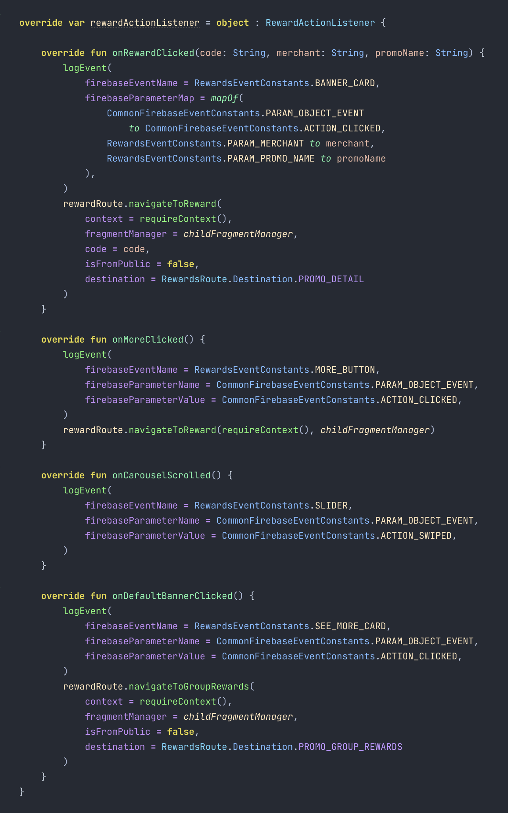
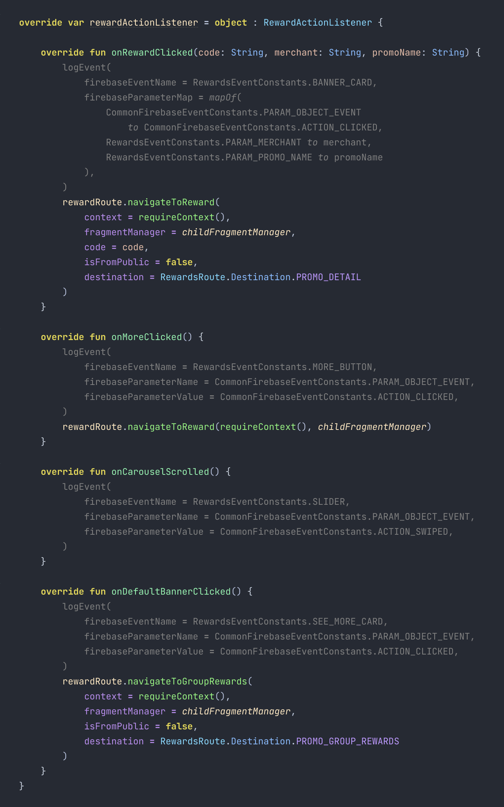
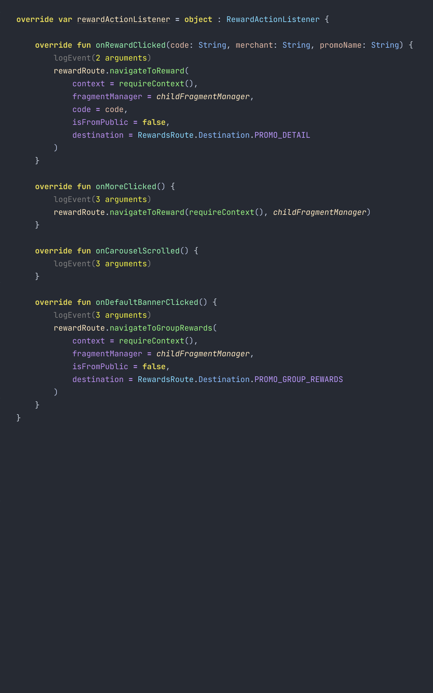

# Lowlighting
[](https://plugins.jetbrains.com/plugin/15206-lowlighting)
[](https://plugins.jetbrains.com/plugin/15206-lowlighting)
[](https://plugins.jetbrains.com/plugin/15206-lowlighting)

A plugin for IntelliJ IDEA and Android Studio.

Lowlights all calls to functions annotated with a custom annotation and allows
folding of all such calls at once.

| Without lowlighting                                    | With lowlighting                                    | Lowlighting collapsed                                    |
|--------------------------------------------------------|-----------------------------------------------------|----------------------------------------------------------|
|  |  |  |

## Usage

1) Declare an annotation. Can be declared either in Java or Kotlin.
    ```kotlin
    package com.playground.analytics
    
    @Retention(value = AnnotationRetention.SOURCE)
    annotation class Lowlight
    ```

2) Create a `.lowlighting` file in the root directory and add the fully qualified name of the annotation.
    ```text
    com.playground.analytics.Lowlight
    ```

3) Annotate a function with the annotation.
    ```kotlin
    @Lowlight
    fun logEvent(
        firebaseEventName: String? = null,
        firebaseParameterName: String? = null,
        firebaseParameterValue: String? = null,
        firebaseParameterMap: Map<String, String?>? = null,
    )
    ```

4) All invocations of the annotated function will be lowlighted.

## Installation

1) Access the Plugins page in IDE settings
  * On Windows:
    - `File` >
     `Settings` (<kbd>Ctrl</kbd>+<kbd>Alt</kbd>+<kbd>S</kbd>) >
     `Plugins`
  * On MacOs:
    - `Preferences` (<kbd>⌘</kbd> <kbd>,</kbd>) >
      `Plugins`

2) Install plugin
  - Conveniently from within IDE:
    - `Plugins` >
      `Marketplace` >
      `Search for "Lowlighting"` >
      `Install`
  - Or download the [latest release](https://plugins.jetbrains.com/plugin/15206-lowlighting) and install it manually using:
    - `Plugins` >
      `⚙️` >
      `Install plugin from disk...`


## License
[Apache License 2.0](https://choosealicense.com/licenses/apache-2.0/)
